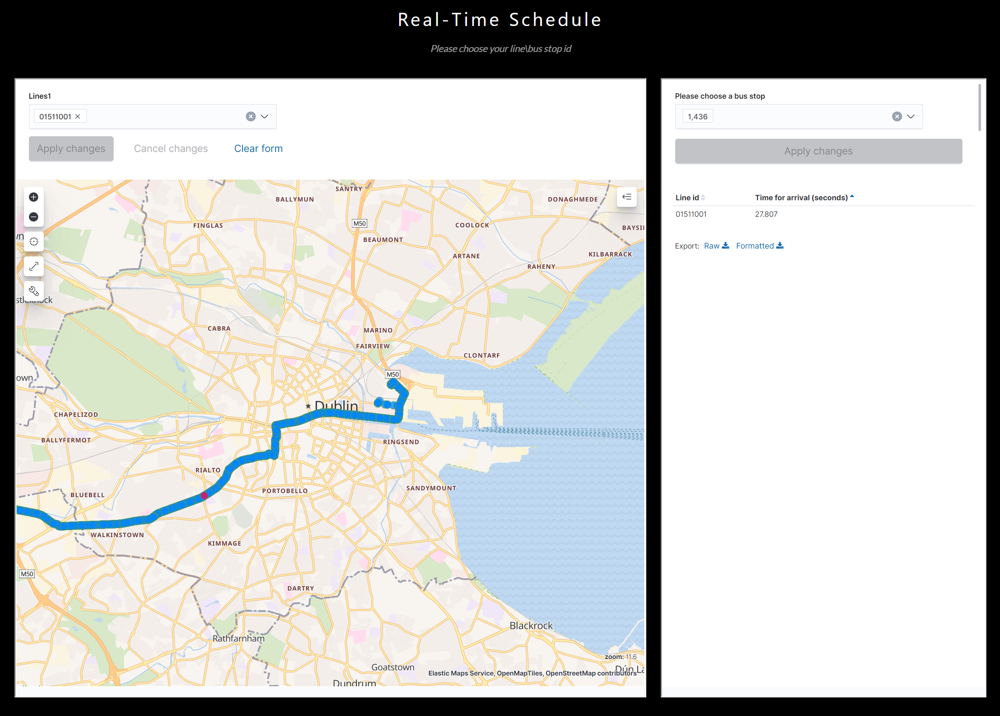

# GetBus
GetBus -  By Oren Ploznik & David Galambos

## Overview
GetBus is an app that will ease your schedule by letting you know your when and where your rides 🚍🚇🚘🛴.

🏆You wait for your bus and don't know where it is? you need GetBus...🏆

### Find when the next bus will apear in your bus stop!
Just let us know your bus stop number and we will tell you when the next bus is coming.

### Watch your buses in real-time while it's advance toward you!
All you need is to enter the bus number and we will show you where it is and it's route toward you.

## How to use the application?
Just enter http://orendavidlab.herokuapp.com/

# Running the code

## Setup preparations

Before running the code you should install all the necessary requirements.
you can install it by running the following script:  

`pip install -r requirements.txt`

Make sure you have docker and docker-compose and then run the following script:  
`sudo docker-compose up &`

# About the script
 
The final.ipynb notebook load and process the Dublin bus data set 
Combines it with the precise locations of the bus stations and traffic lights in Dublin (assume processed and saved in elastic) 
Employs regression imputation on missing values (pre-trained model) 
Predict the traffic speed in each bus proximity (pre-trained model) 
Estimate the travel time to the next station (pre-trained model) 
Load all the data to elastic 
 
The script support both Batch and Streaming data with kafka 
Adjust the related parameters according to your data 
 
The external data (stops & lights) can be processed and uploaded to elatic by changing: 
upload_stops_data to True , upload_lights_data to True 
and update the path parameters 
 
All pre-trained models can be recreated by changing : create_new_static_data to True 
(compatible only with batch data, should not be piplined with the rest of the script) 
  
To use your own data please change the following lines in your code:  
`schema = pickle.load(open("/dbfs/mnt/schema.pkl", "rb"))`  
`bus_data_location = '/mnt/dacoursedatabricksstg/dacoursedatabricksdata/busFile'`