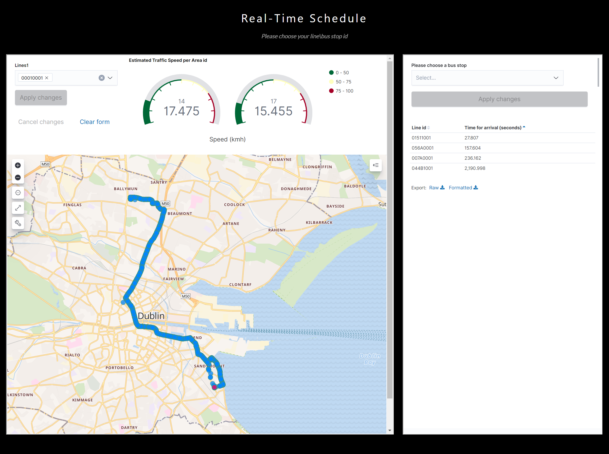

# GetBus
GetBus -  By Oren Ploznik & David Galambos

## Overview
GetBus is an app that will ease your schedule by letting you know your when and where your rides 🚍🚇🚘🛴.

🏆You wait for your bus and don't know where it is? you need GetBus...🏆

### Find when the next bus will apear in your bus stop!
Just let us know your bus stop number and we will tell you when the next bus is coming.

### Watch your buses in real-time while it's advance toward you!
All you need is to enter the bus number and we will show you where it is and it's route toward you.

## How to use the application?
Just enter http://orendavidlab.herokuapp.com/

# Running the code

## Setup preparations

Before running the code you should install all the necessary requirements.
you can install it by running the following script:  

`pip install -r requirements.txt`

Make sure you have docker and docker-compose and then run the following script:  
`sudo docker-compose up &` 